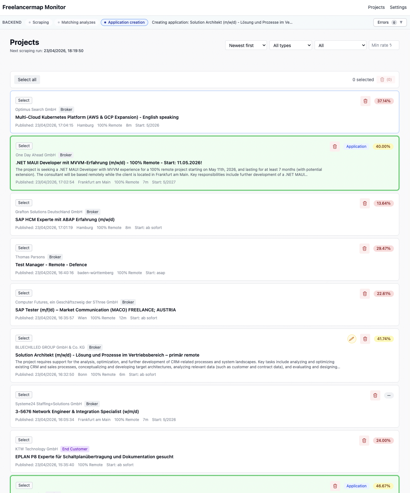
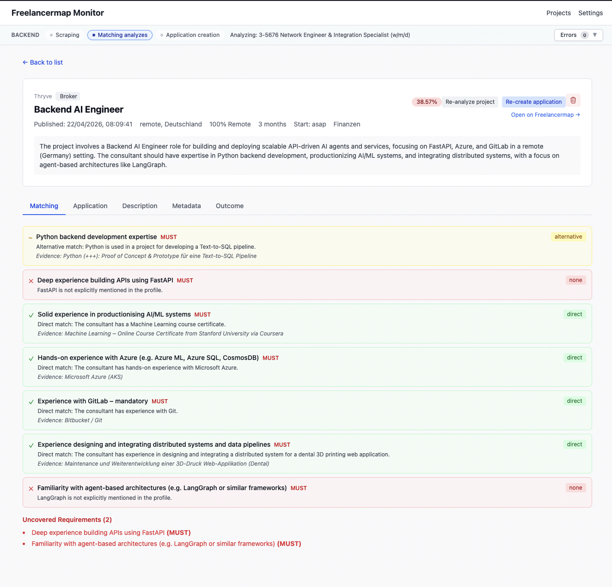
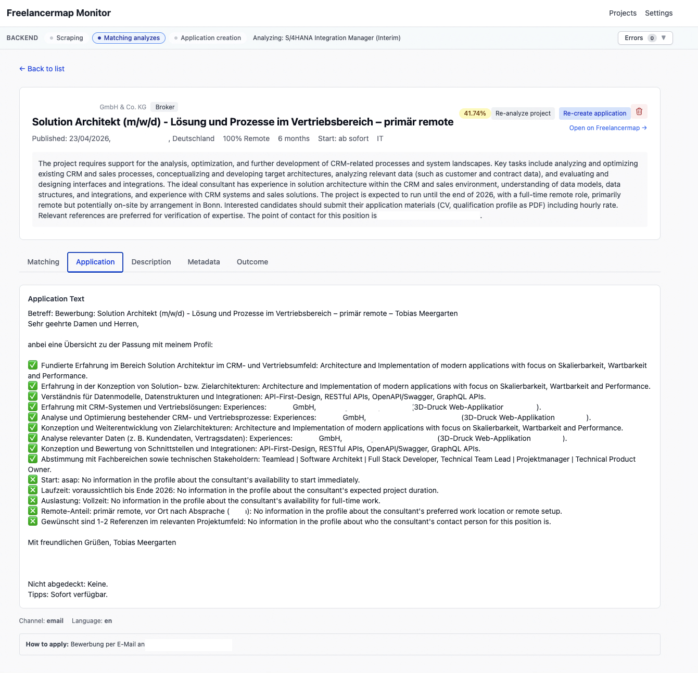
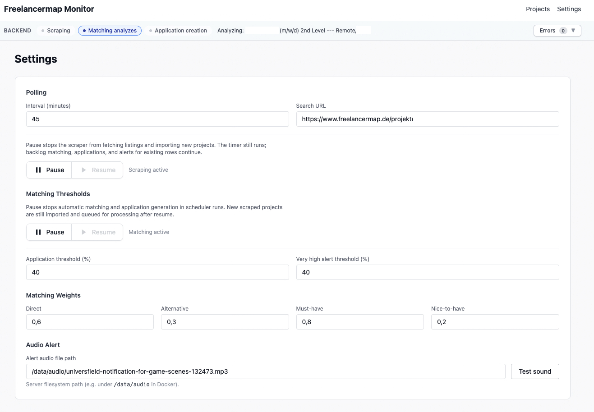

# Freelancer Monitor

A small, self-hosted pipeline that watches [freelancermap.de](https://www.freelancermap.de)
for new IT freelance projects, analyzes each posting with a **local LLM** via
[Ollama](https://ollama.com), scores the fit against your consultant profile and
pre-drafts an application — all inside a Docker Compose stack on your own
machine. No cloud API calls, no data leaving your laptop.

## Goal

If you work as a freelance consultant you know the drill: refresh the portal
every hour, read a dozen postings to figure out which ones are actually a match,
and then rewrite the same handful of bullet points over and over. The tool
automates the boring parts and leaves the judgement calls to you:

1. **Find** new postings that match a pre-filtered search URL.
2. **Extract** atomic requirements from the free-text description.
3. **Match** each requirement against a structured consultant profile
   (skills, experiences, certifications) — direct match, alternative, or none.
4. **Score** the project with configurable weights (must-have vs. nice-to-have,
   direct vs. alternative).
5. **Draft** an application letter in the project's language, with a ✅/❎ bullet
   list per requirement, only when the match rate crosses a threshold.
6. **Alert** you (UI + audio) when something crosses the "very high match"
   threshold so you can jump on it first.

## Why this exists — learning project disclaimer

This is an **open source learning project**. Its main purpose is to explore:

- **Local LLMs via Ollama** — can a 7B model running on a laptop actually do
  something useful with long, messy, real-world job postings?
- **The Model Context Protocol (MCP)** — the stack wraps each LLM call as an
  MCP tool (`extract_requirements`, `match_requirements`, `classify_poster`,
  `generate_application`, `generate_summary`, `detect_language`) served over
  SSE. Browser automation lives behind a second MCP server wrapping Playwright.

**Full disclosure:** for this static single-host pipeline, MCP is massively
over-engineered. A plain HTTP call or an in-process function would work just as
well. It's here on purpose — to learn the protocol, see what it feels like to
design tools for it, and have a base that could plug into an MCP-capable agent
(Claude Desktop, Cursor, etc.) later without any changes to the tool code.
Treat the MCP layer as a teaching exhibit, not as a production recommendation.

## Architecture

```
 ┌────────────────────┐          ┌────────────────────────┐
 │  Vue 3 + Vite UI   │◀─REST/WS─│  NestJS Backend        │
 │  (frontend)        │          │  Scheduler · Matching  │
 └────────────────────┘          │  Scraping · Dashboard  │
                                 └──────────┬─────────────┘
                                            │ MCP (SSE)
                   ┌────────────────────────┼───────────────────────────┐
                   ▼                        ▼                           ▼
        ┌────────────────────┐   ┌────────────────────┐   ┌────────────────────┐
        │  ollama-mcp        │   │  playwright-mcp    │   │  MySQL 8           │
        │  LLM tool wrappers │──▶│  Browser scraping  │   │  Projects, matches │
        │  (Node + SDK)      │   │  (Playwright)      │   │  profile, apps     │
        └─────────┬──────────┘   └────────────────────┘   └────────────────────┘
                  │ HTTP /api/generate
                  ▼
        ┌────────────────────┐
        │  Ollama            │
        │  (e.g. mistral 7B) │
        └────────────────────┘
```

### Containers

| Service          | Purpose                                                                                      |
| ---------------- | -------------------------------------------------------------------------------------------- |
| `mysql`          | Persistent store for projects, requirements, matches, applications, settings.                |
| `ollama`         | Local LLM runtime. You can also run it on the host and point the stack at it.                |
| `ollama-mcp`     | Node MCP server that exposes `extract_requirements`, `match_requirements`, `classify_poster`, `generate_application`, `generate_summary`, `detect_language` as tools over SSE. |
| `playwright-mcp` | MCP server wrapping a headless Chromium for the scraping flow.                               |
| `backend`        | NestJS app: scheduler + scraping orchestration, matching math, application persistence, REST + WebSocket API for the UI. |
| `frontend`       | Vue 3 + Vite dashboard: project list, detail view, generated application, settings.          |

### Pipeline (every `POLLING_INTERVAL_MINUTES`)

1. `ScrapingService` asks `playwright-mcp` to log into freelancermap.de and walk
   the configured search URL, yielding new projects (filtered by publish date
   so re-listed stale projects are dropped).
2. For each new project:
   - `ollama-mcp.extract_requirements` → list of atomic requirements.
   - `ollama-mcp.match_requirements` → classification vs. the consultant profile.
   - `MatchingCalculator` → a single weighted percentage.
3. If `rate ≥ MATCHING_THRESHOLD_APPLICATION`: `ollama-mcp.generate_application`
   produces a motivation paragraph (only for direct customers) and a ✅/❎
   bullet list body.
4. If `rate ≥ MATCHING_THRESHOLD_VERY_HIGH`: a WebSocket alert + audio ping is
   pushed to every connected frontend.
5. Any projects that got imported but never matched (e.g. because Ollama was
   down) are picked up as a backlog on the next cycle.

## Screenshots

> Drop PNGs into `docs/images/` using the filenames below and they will render
> automatically. See `docs/images/README.md` for guidance.

### Project list — matching-rate badges at a glance



### Project detail — per-requirement match breakdown



### Generated application — ready to copy into your email client



### Settings — thresholds, polling interval, pause switches



## Setup

### Prerequisites

- Docker + Docker Compose (Docker Desktop on macOS/Windows, or engine + plugin
  on Linux).
- [Ollama](https://ollama.com/download) installed on the host, or uncomment the
  bundled `ollama` service and let compose run it for you.
- A freelancermap.de account (the scraper logs in to reach full descriptions).
- ~8 GB of free RAM for a 7B model. More is better.

### Clone and configure

```bash
git clone <your-fork-url> freelancer_monitor
cd freelancer_monitor
cp .env.example .env
```

Edit `.env` and set at least:

- `FREELANCERMAP_EMAIL` / `FREELANCERMAP_PASSWORD`
- `FREELANCERMAP_SEARCH_URL` — paste your own pre-filtered search URL from
  freelancermap (category, contract type, remote %, etc.).
- `MYSQL_PASSWORD` / `MYSQL_ROOT_PASSWORD`
- `OLLAMA_MODEL` — default is `mistral`; any Ollama-compatible tag works.

### Pull the LLM model

Once, on the host that runs Ollama:

```bash
ollama pull mistral
```

Swap to any model you prefer (`llama3.1`, `qwen2.5`, `mixtral`…). Larger models
give noticeably better matches and applications at the cost of latency and RAM.

### Provide your consultant profile and application prompt

The matcher and the application generator need two personal files. Both are
**gitignored**, and each ships with a `*.example.*` template that is tracked
in the repo — copy, then edit:

```bash
cp data/profile/consultant-profile.example.json data/profile/consultant-profile.json
cp ollama-mcp/prompts/application_prompt.example.md ollama-mcp/prompts/application_prompt.md
```

1. **`data/profile/consultant-profile.json`** — structured JSON with your
   skills, experiences, certifications, industries, domains, focus areas and
   service offerings. The template shows the exact shape; the authoritative
   schema lives in
   `backend/src/database/entities/consultant-profile.entity.ts` and its
   siblings. This file is read by the `run-seed.ts` script that populates the
   database on first start and is also passed verbatim to the LLM at match
   time.
2. **`ollama-mcp/prompts/application_prompt.md`** — the system prompt that
   drives application drafting. It contains your name, tone preferences and
   contact block. The template uses `[Your Full Name]`, `[your.email@example.com]`
   and similar placeholders; replace them with your real data. **Do not remove
   the `{{CONSULTANT_PROFILE_JSON}}` placeholder** — the MCP server substitutes
   it with the consultant profile JSON at runtime, which is what keeps the LLM
   honest about your skills.

If `application_prompt.md` is missing, the MCP server silently falls back to a
generic built-in prompt (see `GENERATE_APPLICATION_PROMPT_LEGACY` in
`ollama-mcp/src/prompts/system-prompts.ts`). Missing
`consultant-profile.json`, however, will make the seed step fail — so create
that file before the first `docker compose up`.

### Start everything

```bash
docker compose up -d --build
```

Check the health of each service:

```bash
docker compose ps
docker compose logs -f backend ollama-mcp
```

Open the UI:

- Frontend: <http://localhost:3000>
- Backend REST: <http://localhost:4000/api>
- Ollama-MCP health: <http://localhost:3100/health>
- Playwright-MCP health: <http://localhost:3200/health>

## Configuration reference

| Variable                             | Default   | Meaning                                                                                       |
| ------------------------------------ | --------- | --------------------------------------------------------------------------------------------- |
| `POLLING_INTERVAL_MINUTES`           | `30`      | How often the scheduler polls freelancermap and processes the backlog.                        |
| `MATCHING_THRESHOLD_APPLICATION`     | `40`      | Minimum match rate (%) to auto-draft an application.                                          |
| `MATCHING_THRESHOLD_VERY_HIGH`       | `85`      | Match rate (%) that triggers the UI + audio alert.                                            |
| `WEIGHT_DIRECT` / `WEIGHT_ALTERNATIVE` | `1.0` / `0.5` | Score per requirement based on match type.                                             |
| `WEIGHT_MUST_HAVE` / `WEIGHT_NICE_TO_HAVE` | `2.0` / `1.0` | Importance multiplier per requirement.                                            |
| `FREELANCERMAP_MAX_PROJECT_AGE_DAYS` | `2`       | Reject re-listed stale projects older than N days.                                            |
| `FREELANCERMAP_MAX_LIST_PAGES`       | unset     | Optional cap on scraped list pages per run.                                                   |
| `OLLAMA_MODEL`                       | `mistral` | Ollama model tag used by all tools.                                                           |
| `OLLAMA_JSON_NUM_PREDICT`            | `16384`   | Token budget for JSON-producing tools (application generation needs the most).                |
| `OLLAMA_NUM_PREDICT`                 | `4096`    | Token budget for free-text tools (summary, language detection).                               |
| `ALERT_AUDIO_FILE`                   | `/data/audio/alert.mp3` | Path (inside the backend container) to the sound file played on high-match alerts. |

Many of these can also be changed at runtime through the Settings view — the
values in `settings` table take precedence over the env defaults. Pausing
scraping and/or matching is a single toggle in the UI (useful while iterating
on prompts).

## Operation

### Day-to-day

- **Monitor** the project list; matches sort by rate.
- Click a project to open **Project Detail** and see which requirements matched
  directly, which only via an alternative, and which the profile doesn't cover.
- For projects above the application threshold, open **Application**, copy the
  draft, and send it from your regular email client. The draft is deliberately
  short and contains ✅/❎ bullets so a recruiter can decide in under a minute.
- **Settings** lets you adjust thresholds, pause polling (e.g. on weekends) and
  re-run matching on demand.

### Maintenance

- **Rebuild a single service** after code changes:

  ```bash
  npm run backend:rebuild:compose
  npm run frontend:rebuild:compose
  npm run app:rebuild:compose       # both
  ```

- **Tail logs** per service:

  ```bash
  docker compose logs -f ollama-mcp
  docker compose logs -f backend
  ```

- **Swap the LLM model**: change `OLLAMA_MODEL` in `.env`, run
  `ollama pull <new-model>`, `docker compose restart ollama-mcp backend`.
- **Inspect MCP tool output** directly:

  ```bash
  curl -N http://localhost:3100/sse              # open the SSE stream
  # and use any MCP client or the NestJS backend as the caller
  ```

### Troubleshooting

- **`Ollama request failed` / timeouts**: the backend is trying to reach Ollama
  via `host.docker.internal`. On Linux either run Ollama inside the compose
  stack (uncomment the `ollama` service's network reference) or set
  `OLLAMA_HOST` to your host IP.
- **`Expected ',' or ']' after array element in JSON at position ...`** from
  `generate_application`: the model ran out of `num_predict` tokens mid-string.
  Raise `OLLAMA_JSON_NUM_PREDICT` (e.g. `32768`). The MCP server logs a warning
  whenever Ollama reports `done_reason=length` so you can tell truncation apart
  from genuinely broken JSON.
- **Scraper returns 0 projects**: check that your freelancermap credentials are
  correct and that the search URL still loads while logged in — the site
  occasionally tweaks its markup; `backend/src/scraping/project-parser.service.ts`
  is where the selectors live.
- **Frontend says "Backend offline"**: `docker compose ps` → backend usually
  waits for `mysql` and both MCP servers to be healthy; give it 30–60 seconds
  on a cold start.

## Repository layout

```
.
├── backend/              NestJS app (scheduler, scraping, matching, application, dashboard)
├── frontend/             Vue 3 + Vite dashboard
├── ollama-mcp/           MCP server exposing LLM tools over SSE (Ollama client + prompts)
│   └── prompts/
│       ├── application_prompt.example.md   tracked template
│       └── application_prompt.md           gitignored, personal
├── playwright-mcp/       MCP server exposing headless-browser scraping primitives
├── data/
│   ├── profile/
│   │   ├── consultant-profile.example.json  tracked template
│   │   └── consultant-profile.json          gitignored, personal (you provide this)
│   └── audio/            alert sound files
├── docker-compose.yml    full stack (mysql, ollama, both MCP servers, backend, frontend)
├── .env.example          copy to .env and fill in
└── docs/images/          screenshots referenced from this README
```

## Contributing

This is a hobby / learning repo — PRs and issues are welcome, especially
around:

- Better prompts for non-German postings.
- Structured output schemas (JSON Schema / grammar constraints) for the
  extraction and matching tools.
- Alternative LLM backends (llama.cpp, vLLM, LM Studio) behind the same MCP
  interface.

## License

MIT — see `LICENSE` (add one if you fork this and want to publish; the default
assumption is that the code is provided as-is for learning purposes).
